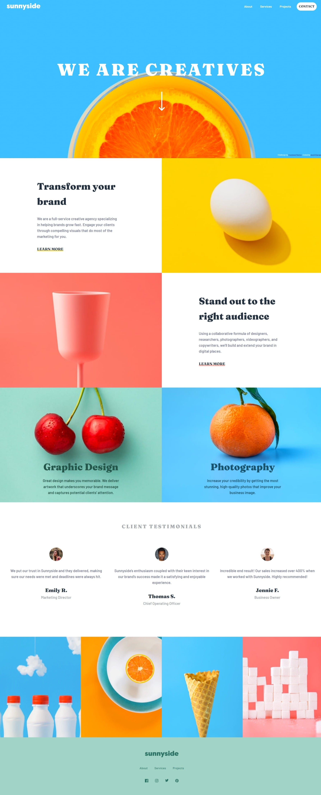
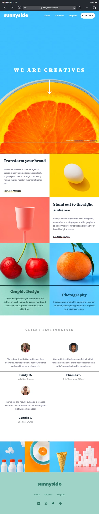
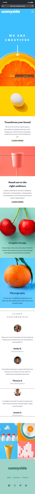

# Frontend Mentor - Sunnyside agency landing page solution

This is a solution to the [Sunnyside agency landing page challenge on Frontend Mentor](https://www.frontendmentor.io/challenges/sunnyside-agency-landing-page-7yVs3B6ef). Frontend Mentor challenges help you improve your coding skills by building realistic projects.

## Table of contents

- [Frontend Mentor - Sunnyside agency landing page solution](#frontend-mentor---sunnyside-agency-landing-page-solution)
  - [Table of contents](#table-of-contents)
  - [Overview](#overview)
    - [The challenge](#the-challenge)
    - [Screenshot](#screenshot)
    - [Links](#links)
  - [My process](#my-process)
    - [Built with](#built-with)
    - [What I learned](#what-i-learned)
    - [Continued development](#continued-development)
    - [Useful resources](#useful-resources)
      - [HTML](#html)
      - [SASS/CSS](#sasscss)
      - [Responsive development](#responsive-development)
      - [Additional Tools](#additional-tools)
  - [Author](#author)
  - [Acknowledgments](#acknowledgments)

## Overview

### The challenge

Users should be able to:

- View the optimal layout for the site depending on their device's screen size
- See hover states for all interactive elements on the page

### Screenshot





### Links

- Solution URL: [GitHub Repo](https://github.com/devCKVargas/sunnyside-agency-landing-page-challenge)
- Live Site URL: [](https://devckvargas-sunnyside-2023.netlify.app/)

## My process

### Built with

- Semantic HTML5 markup
- Mobile-first workflow
- CSS custom properties
- CSS Grid
- Flexbox
- [SASS](https://sass-lang.com/) - For styles

### What I learned

- I should plan my structure in both layout and markup. These are the foundations of any website. I say this because I found myself rewriting parts of it. I even rewrote after completing half of it.
- Use grid on the main layouts, and interchange both grid & flexbox, whichever is more efficient.
- I properly use the correct pseudo-element: focus-visible instead of focus.
- Don't nest too deep, both the files & the code. As it will lead to a deeper struggle in the long run.

```html
<a href="#" target="_blank" rel="noreferrer"> 
 <!--  noreferrer or noopener values. It prevents leaking user agent's header from being sent to the new page. -->
```

```CSS
/* anchors with a class has no underline */
a {
 text-decoration: none;
}

a:not([class]) {
 text-decoration: underline;
}
```

```CSS / JS
/** 
* Changing CSS variables in JS 
* Used to change the selection background when the user scrolls & activates the background of the header
*/
 :focus-visible {
  outline: thick solid var(--selection-bg);
 }

 header.style.setProperty("--selection-bg", "var(--clr-primary)");
```

```scss (CSS)
/** 
* mixin: convert pixels(px) to (relative units eg. em/rem)
* Usage:
* @include minMedia(600em) 
* $breakpoint-md: 600em;
* @include minMedia($breakpoint-md) 
* /

@mixin minMedia($breakpoint) {
 @media only screen and (min-width: calc($breakpoint / 16)) {
  @content;
 }
}
```

```scss (CSS)
/* mobile viewport fix */

body {
 min-height: 100vh;
 min-height: -webkit-fill-available;

 @supports (min-height: 100svh) {
  min-height: 100svh;
 }
}
```

```scss (CSS)
/* firefox fix * /
@supports (min-height: -moz-available) {

 html,
 body {
  min-height: -moz-available;
  height: 100%;
 }
}
```

### Continued development

- :focus-visible instead of :focus

```CSS
/* Navigation menu pointer triangle */
&::before {
   content: "";
   display: block;
   height: 0;
   width: 0;
   position: absolute;
   top: -2.9rem;
   right: 0;
   border-top: 3rem solid var(--clr-white);
   border-left: 3rem solid transparent;
   transform: rotate(90deg);
  }
```

```CSS
/* Infinitely looping animation: infinite + alternate */
&__arrow {
  animation: arrow-anim 1s ease-in-out infinite alternate;
 }
```

### Useful resources

#### HTML

- [HTML Best Practices](https://github.com/hail2u/html-best-practices)

#### SASS/CSS

- [CSS Normalize](https://csstools.github.io/normalize.css/)
- [SASS 7-1-pattern](https://sass-guidelin.es/#the-7-1-pattern)
- [SASS boilerplate](https://github.com/KittyGiraudel/sass-boilerplate/)
- [CSS Custom Properties](https://css-tricks.com/breaking-css-custom-properties-out-of-root-might-be-a-good-idea/) - Taught me how powerful CSS Properties/Variables are and why global scope isn’t right for everything.
- [CSS fix for 100vh in mobile WebKit](https://css-tricks.com/css-fix-for-100vh-in-mobile-webkit/)
- [Minimum Static Site Setup with Sass](https://thinkdobecreate.com/articles/minimum-static-site-sass-setup/) - Watching SASS files made easy with NPM using this one by [Stephanie Eckles](https://thinkdobecreate.com/)

#### Responsive development

- [Mobile simulator - responsive testing tool(Browser Extension)](https://www.webmobilefirst.com/)
- [Responsive Viewer(Browser Extension)](https://responsiveviewer.org/)
- [Responsively](https://responsively.app/)

#### Additional Tools

- [SVG optimizater(NPM)](https://github.com/svg/svgo)
- [Image optimizer(Online)](https://squoosh.app/)
- [Can I Use](https://caniuse.com/) - Since I target browsers from March 2021 to the latest. This was really helpful regardless.

## Author

- Website - [GitHub](https://github.com/devCKVargas/)
- Frontend Mentor - [@devckvargas](https://www.frontendmentor.io/profile/devckvargas)
- Twitter - [@devckvargas](https://www.twitter.com/devckvargas)

## Acknowledgments

- Jhon Queñano - [GitHub](https://github.com/okayda/)

His own solution to this challenge was one of my inspiration. Thank you Jhon!
